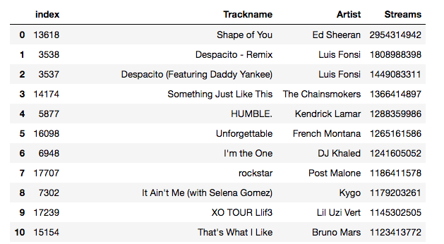
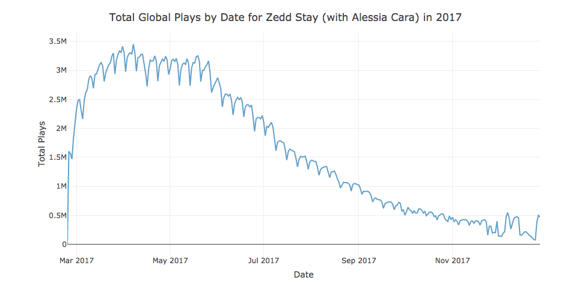
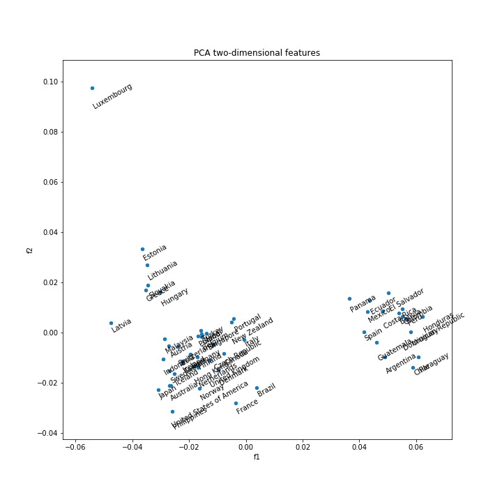

# Spotify Analysis - Top 200 Songs Played in 2017

## Link to Data dashboard: https://spotify-app-dash.herokuapp.com/

### Data Source

This data set came from Kaggle: [Data Set Link](https://www.kaggle.com/edumucelli/spotifys-worldwide-daily-song-ranking).

### Explanation of Files and Directories
* resources - images for the Jupyter notebooks
* app.py - code for a Plotly online data dashboard
* peak_dates_world_songs.csv - data for the Plotly dashboard. This data is outputted by spotifyanalysis.ipynb
* regions.json - data for mapping country to language - used in the data dashboard
* roughdraft.ipynb - exploratory data analysis
* spotifyanalysis.ipynb - cleaned and formatted exploratory data analysis
* spotifys-worldwide-daily-song-ranking.zip - original data set
* total_plays_by_date.csv - data for the Plotly dashboard. This data is outputted by spotifyanalysis.ipynb
* world-countries.json - world map file

### Key Findings

See [spotifynalaysis.ipynb](https://github.com/andrewpaster/spotify_top200_dataset/blob/master/spotifyanalysis.ipynb) for more key findings and code.

#### Ed Sheeran Dominated the Year

#### Songs Tend to Peak When They First Come Out and there is often a Spike near the End of the Year

#### Spanish Speaking Country Listening Habits Have a Clear Cluster Separate from the Rest of the World

